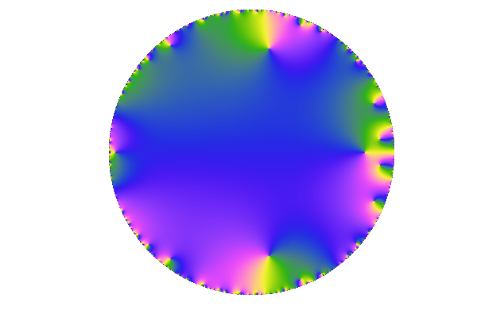
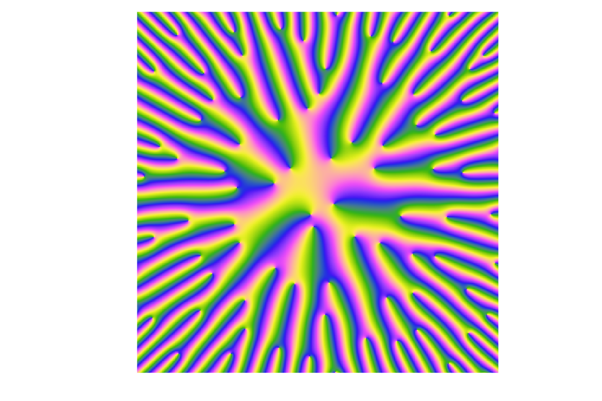
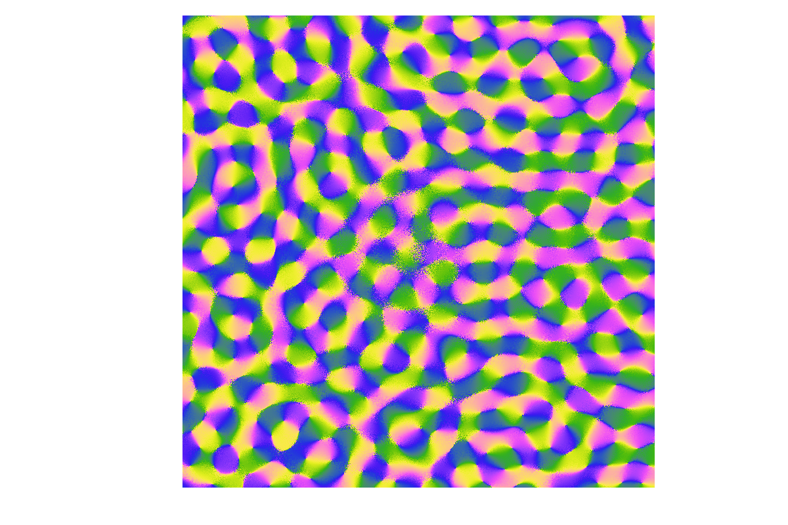
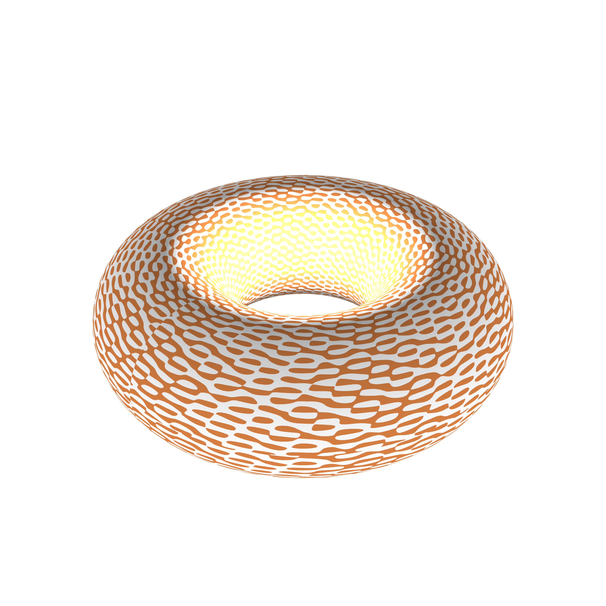

# RandomPictures
Code for illustrations and pictures. 

## Phase portrait for the elliptic law

See 

k
## Random Rademacher Taylor series

Phase portrait of a random polynomial of degree 2001 with +/-1 random coefficients. By Ryll-Nardzewski's theorem, the limiting random analytic function has a natural border at the border of the disk of radius 1, its domain of convergence, see JP Kahane's book *Some random series of functions*, chapter 4. 

## Gaussian Entire Function

Phase portrait of the Gaussien Entire Function on [-8,8]x[-8,8]. I only kept the Taylor polynomial up to degree 200. The zero set is stationary, see the *GEF Book* by Hough et al. 

## Gaussian random wave

Phase portrait of the complex gaussian random wave, ie a random solution of Helmotz's equation in the complex plane (real part + complex part). See [this paper by Nourdin Peccati and Rossi](https://arxiv.org/pdf/1708.02281.pdf) and especially the representation in equation 1.5. 

As you see I get some kind of pixelized effect, I don't know why. 

## Random arithmetic wave

The solutions of the Laplace equations on the torus have energy 4*pi*n where n can be written as the [sum of two squares](https://en.wikipedia.org/wiki/Sum_of_two_squares_theorem) and the dimension of the associated eigenspace is the number of ways to write n as a sum of two squares. Here are the nodal domains of one random (gaussian) eigenfunction associated with n=85. 

See also the [Krishnapur et al.](https://arxiv.org/pdf/1111.2800.pdf) paper.

Picture is in 4k so might take time to load. More will follow. 

